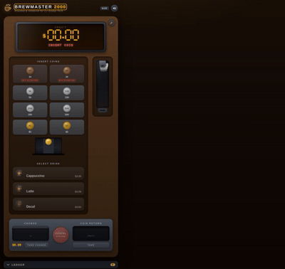
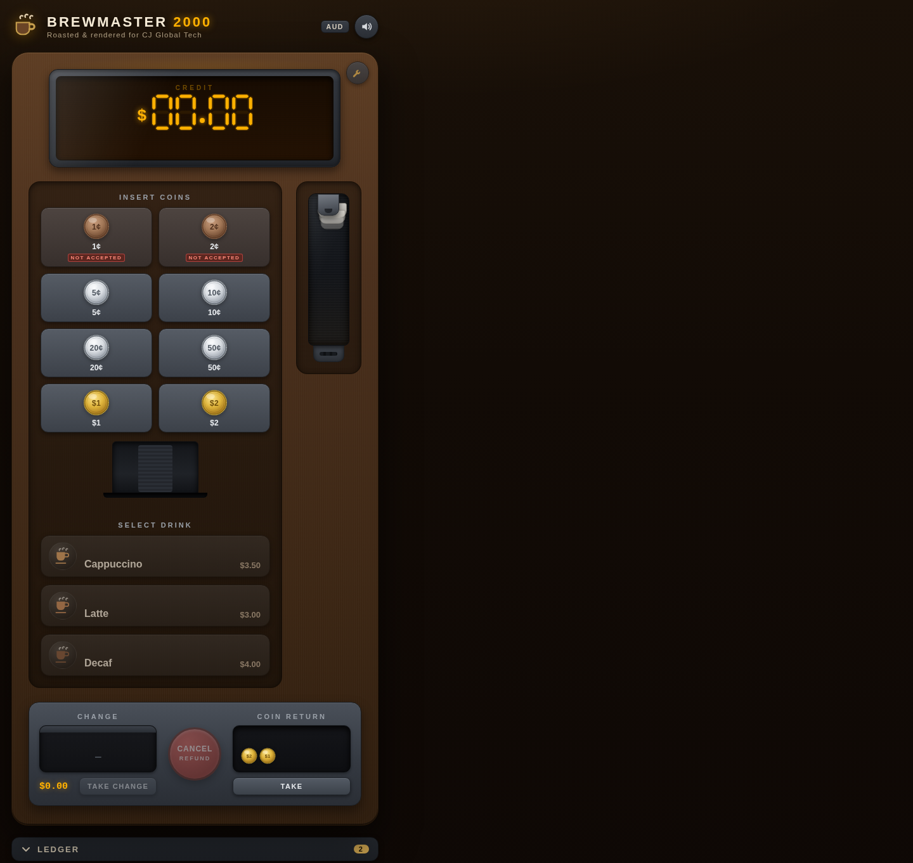
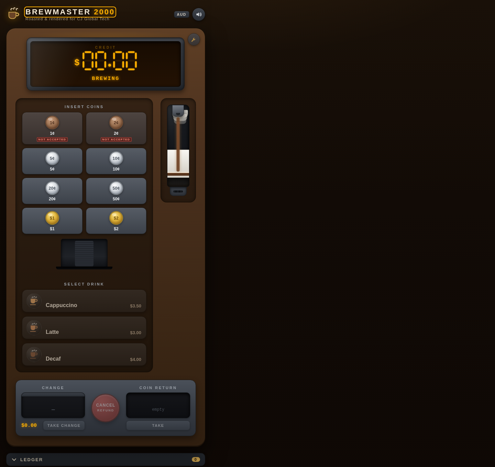
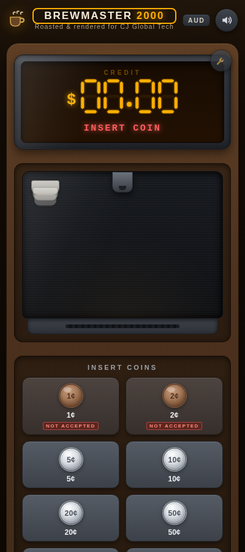
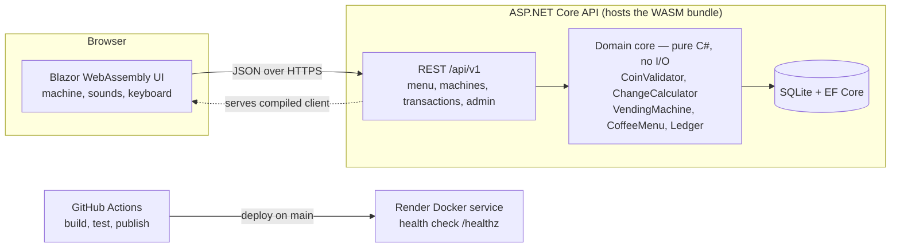

# Virtual Coffee Machine

A coin-operated vending machine rendered as a polished Blazor WebAssembly app —
insert Australian coins, watch the 1¢ and 2¢ get spat into the coin return, brew
one of three coffees, and take your change, broken into coinage.

[](https://github.com/XanderCaulfield/virtual-coffee-machine/actions/workflows/ci.yml)
[](#testing)
[](LICENSE)
[](https://virtual-coffee-machine.onrender.com)

## Tech stack at a glance

| Area | Choice |
|---|---|
| Language & runtime | C# 12 on .NET 8 LTS |
| Web API | ASP.NET Core (controller-based), REST + JSON, RFC 7807 errors, Swagger/OpenAPI |
| Frontend | Blazor WebAssembly (hosted), Razor components, hand-built SVG/CSS animation, WebAudio sounds |
| Data | EF Core 8 + SQLite (documented MySQL swap) |
| Testing | xUnit, `WebApplicationFactory` integration tests, headless-browser pass |
| Build & deploy | GitHub Actions CI, multi-stage non-root Docker, Render Blueprint |

## Live demo

**https://virtual-coffee-machine.onrender.com** — deployed via the one-click
[render.yaml](render.yaml) Blueprint; see [docs/DEPLOYMENT.md](docs/DEPLOYMENT.md).

> The free tier sleeps after ~15 minutes of idle traffic. The next request
> cold-starts it, so the first paint can take **~1 minute**. Here is the whole
> purchase while you wait:



## The assignment, satisfied

The brief: a coffee machine that accepts **1, 2, 5, 10, 20, 50 cent, 1 and 2
dollar coins** (1¢ and 2¢ are rejected), sells **three coffees**, and returns
**change broken into coinage**.

| Requirement | How it's satisfied |
|---|---|
| Accepts 5¢–$2 coins | `CoinValidator` accepts exactly 5, 10, 20, 50, 100, 200 cents; each insert credits the balance and feeds the coin stock |
| Rejects 1¢ and 2¢ | Recognised-but-rejected: the machine flashes `1¢ REJECTED` / `2¢ REJECTED` and drops the coin into the coin-return tray, without touching the balance |
| Three coffees | Cappuccino **$3.50**, Latte **$3.00**, Decaf **$4.00** (`CoffeeMenu`) |
| Dispenses the coffee | Full purchase flow: cup drop → pour → steam → `ENJOY!` |
| Change broken into coinage | `ChangeCalculator` returns the exact coin breakdown (e.g. $5.00 − $3.50 = **$1.00 + 50¢**), dispensed from the machine's coin stock — never 1¢/2¢ |

Two deliberate extras, because real machines have them:

- **Exact change mode.** If the coin stock can't cover the change for any
  affordable drink, the machine shows `EXACT CHANGE ONLY` and refuses the sale
  while holding your credit — add more coins, or press coin return to collect
  it. No silent overpay.
- **A real coin stock.** Inserted coins are what the machine pays change from.
  Run it dry and the service panel can restock it.

## Features

| | |
|---|---|
| **Full vending UX** | LED 7-segment credit display, coin slot that swallows coins one at a time, three drink buttons that light up when affordable, cup that drops and fills, change tray that cascades coins with clinks |
| **Rejected-coin tray** | 1¢ and 2¢ buttons are visible (marked *not accepted*) and always land in the coin return, which you can click to take |
| **Exact-change mode** | Inventory-aware: `EXACT CHANGE ONLY` refuses the sale and holds your credit — insert more coins or press coin return |
| **Append-only ledger** | Every purchase and refund recorded; a panel shows the transaction history, newest first |
| **Service panel** | A discreet wrench opens an admin dialog to restock coins and drinks |
| **Sounds** | WebAudio-generated coin clinks, pour and hum — with a mute toggle; audio unlocks on first gesture |
| **Keyboard driven** | `Q W E R T Y` insert 5¢/10¢/20¢/50¢/$1/$2 · `1 2 3` select drinks · `C` cancels & refunds · `M` mutes |
| **Accessible** | `aria-live` status display, labelled buttons, and a `prefers-reduced-motion` mode that compresses the brew to near-instant |
| **Responsive** | The machine restacks for phones down to 400 px wide |
| **Per-visitor machines** | Each browser tab gets its own machine (a session GUID), persisted server-side in SQLite — refresh mid-brew and your balance survives |

<table>
<tr>
<td></td>
<td></td>
</tr>
<tr>
<td></td>
</tr>
</table>

## Architecture

Browser → Blazor WebAssembly (hosted by the API) → REST `/api/v1` → domain core → SQLite.
CI builds and tests every PR; pushes to `main` trigger the Render deploy.



```
virtual-coffee-machine/
├── CoffeeMachine.sln
├── src/
│   ├── CoffeeMachine.Contracts/        # DTOs shared by Api + Client
│   ├── CoffeeMachine.Domain/           # pure C#, zero dependencies
│   │   ├── Money/                      #   denominations, validator, greedy change, formatting
│   │   ├── Machine/                    #   state machine, inventory
│   │   ├── Menu/                       #   three drinks
│   │   └── Ledger/                     #   transactions
│   ├── CoffeeMachine.Api/              # REST API + hosts the WASM client
│   │   ├── Controllers/                #   Menu, Machines, Transactions, Admin
│   │   └── Data/                       #   EF Core SQLite, machine registry
│   └── CoffeeMachine.Client/           # Blazor WASM UI
│       ├── Components/                 #   Machine, Display, CoinSlot, CupArea, …
│       └── Services/                   #   API client, sounds, motion prefs
├── tests/
│   ├── CoffeeMachine.Domain.Tests/     # exhaustive change proof, state machine, …
│   ├── CoffeeMachine.Api.Tests/        # WebApplicationFactory + in-memory SQLite
│   └── CoffeeMachine.Client.Tests/     # API client unit tests
├── docs/                               # DEPLOYMENT.md, BUILD_PLAN.md, images/
├── Dockerfile                          # multi-stage, non-root, HEALTHCHECK /healthz
├── render.yaml                         # Render Blueprint (one-click deploy)
└── .github/workflows/ci.yml            # build + test on PR, publish on main
```

## Quickstart

**Prerequisites:** the [.NET 8 SDK](https://dotnet.microsoft.com/download/dotnet/8.0)
(8.0.x). Docker is optional and only needed for the container workflow.

```bash
git clone git@github.com:XanderCaulfield/virtual-coffee-machine.git
cd virtual-coffee-machine
```

### Run it with `dotnet run`

```bash
# Full app — API + hosted Blazor client (single process)
dotnet run --project src/CoffeeMachine.Api
# → http://localhost:5198   (Swagger UI at /swagger, health at /healthz)
```

### Run it with Docker

```bash
docker build -t coffee-machine .
docker run --rm -p 8080:8080 coffee-machine
# → http://localhost:8080
```

The container runs as a non-root user, listens on port 8080 and health-checks
itself via `/healthz`.

## API reference

All endpoints live under `/api/v1`, return JSON, and report errors as
[RFC 7807](https://www.rfc-editor.org/rfc/rfc7807) Problem Details.
Swagger UI is served at `/swagger` in **every environment, including
Production**, so the hosted demo can be explored live.

| # | Method | Path | Request body | Success | Errors |
|---|---|---|---|---|---|
| 1 | `GET` | `/api/v1/menu` | — | `200` menu with `priceDisplay` (`"$3.50"`) | — |
| 2 | `GET` | `/api/v1/machines/{id}` | — | `200` full machine state (created on demand) | `400` invalid machine id |
| 3 | `POST` | `/api/v1/machines/{id}/coins` | `{"denominationCents": 200}` | `200` `{accepted, rejectionReason?, balanceCents, balanceDisplay}` — 1¢/2¢ return `accepted: false` with a reason | `400` invalid machine id or unrecognised coin value |
| 4 | `POST` | `/api/v1/machines/{id}/selections` | `{"itemId": "latte"}` | `200` purchase with change broken into coins | `400` invalid machine id; `409` with `errorCode` ∈ `insufficient-funds` · `out-of-stock` · `exact-change-only` · `unknown-item` |
| 5 | `POST` | `/api/v1/machines/{id}/cancel` | — | `200` refund of the inserted balance, broken into coins | `400` invalid machine id |
| 6 | `GET` | `/api/v1/transactions?machineId=&limit=` | — | `200` ledger rows, newest first (limit defaults to 20, capped at 100) | — |
| 7 | `POST` | `/api/v1/admin/refill?machineId=` | `{"coinDenominations":[...],"coinCounts":[...],"items":{"latte":3}}` | `204` restocked | `400` invalid machine id or malformed request |
| 8 | `GET` | `/healthz` | — | `200 OK` (used by Docker HEALTHCHECK and Render) | — |

Machine ids must be 1–64 characters of `[A-Za-z0-9-]`. Drink ids are the stable
slugs `cappuccino`, `latte`, `decaf`.

### curl examples

```bash
# Insert two $2 coins into machine "desk-1"
curl -s -X POST http://localhost:5198/api/v1/machines/desk-1/coins \
  -H "Content-Type: application/json" -d '{"denominationCents": 200}'
curl -s -X POST http://localhost:5198/api/v1/machines/desk-1/coins \
  -H "Content-Type: application/json" -d '{"denominationCents": 200}'

# Buy a latte ($3.00) — expect $1.00 change as one $1 coin
curl -s -X POST http://localhost:5198/api/v1/machines/desk-1/selections \
  -H "Content-Type: application/json" -d '{"itemId": "latte"}'
# → {"itemId":"latte","itemName":"Latte","priceCents":300,"paidCents":400,
#    "changeTotalCents":100,"change":[{"denominationCents":100,"count":1}]}

# Read the ledger for that machine
curl -s "http://localhost:5198/api/v1/transactions?machineId=desk-1&limit=5"
```

## Testing

**1039 tests, all green** — 960 domain + 68 API integration + 11 client, all in the solution:

```bash
dotnet test        # all 1039 tests (domain + API integration + client)
```

| Layer | What's covered |
|---|---|
| **Domain** (960) | The complete coin-validator matrix (including rejected 1¢/2¢); an **exhaustive change proof** — every amount from 0–4000¢ in 5¢ steps is broken down, checked to sum correctly, never emit 1¢/2¢, and match a dynamic-programming optimum coin-for-coin; the full state machine; inventory & exact-change; cancel/refund; ledger ordering and limits; the shared money formatter |
| **API** (68) | Integration tests via `WebApplicationFactory` + in-memory SQLite — every endpoint, every success shape, and every error path (400s, all four 409 `errorCode` values, 404 for unknown routes, persistence across requests) — plus unit tests for the LED status matrix, RFC 7807 problem shapes, stock-JSON serialization (including corrupt-row reseeding) and the EF ledger |
| **Client** (11) | `MachineApiClient` against a stub `HttpHandler`, error-body parsing, the per-tab machine id store, and the shared affordability checks |
| **Browser pass** | Manual/CDP checks: mobile width, two tabs staying independent, refresh mid-brew restoring state, `prefers-reduced-motion`, keyboard shortcuts, a11y audit |

## Built with AI

Human-designed and reviewed, built at speed with AI — the working style this
role is about. The build was orchestrated by an agent (OpenCode, running
**DeepSeek V4 Pro**) that wrote the plan, split the work across eight
specialised sub-agents, and reviewed every phase before merging it:

| Agent | Owned |
|---|---|
| A0 Scaffold | Solution, projects, CI workflow, Dockerfile |
| A1 Domain | Coins, greedy change, state machine, inventory, ledger |
| A2 API | REST endpoints, EF Core + SQLite, ProblemDetails |
| A3 Frontend | Blazor WASM machine — visuals, animations, sounds, keyboard |
| A4 QA | Adversarial pass — 32 browser checks; found & fixed 7 real bugs |
| A5 DevOps | Render Blueprint, deploy hook, container verification |
| A6 Docs | README, ADRs, demo GIF |
| A7 Final review | Redundancy sweep, dead-code removal, coverage, doc accuracy |

Each agent had exclusive file ownership and acceptance criteria, worked in an
isolated branch, and landed its work as a conventional-commit series that was
reviewed before merging. Boilerplate was delegated; the consequential
decisions — greedy change and its proof, the exact-change stock model, per-tab
machines, the REST contract — were made up front and are documented in the
ADRs. The full orchestration plan every agent worked from is archived at
[docs/BUILD_PLAN.md](docs/BUILD_PLAN.md).

| Metric | Value |
|---|---|
| Build time | ~2 hours of agent work, plan-to-live in one day; ~30 min of human time |
| Agents | 1 orchestrator + 8 sub-agent sessions |
| Model | DeepSeek V4 Pro (via OpenCode) |
| Cost | $4.57 |
| Output | 37 commits, 8 feature branches, ~9,100 lines, 1039 tests, 0 warnings |

## Decisions & deployment

- **Architecture decisions** — see [ADR.md](ADR.md): why Blazor WASM over a JS
  SPA, why greedy change is provably minimal, why SQLite (and how to swap to
  MySQL), per-tab machines, Swagger in production.
- **Deployment** — see [docs/DEPLOYMENT.md](docs/DEPLOYMENT.md): Render
  Blueprint one-click deploy, health check contract, keep-warm, runbook.

## Roadmap

- **MAUI / Blazor Hybrid port** — ship the same machine as a native desktop and
  mobile app.
- **Hardware coin-acceptor integration** — a real coin validator talks the same
  `InsertCoin` domain API; the state machine and change logic stay untouched.
- **Shared multi-user machine** — one machine id with real-time stock and
  balance broadcast to all viewers (the per-visitor model was a deliberate
  demo choice, see ADR-0004).
- **MySQL swap** — productionise the persistence layer by changing the EF Core
  provider (`UseSqlite` → `UseMySql`) and the connection string; the schema and
  every query stay identical.

## License

[MIT](LICENSE) © 2026 Xander Caulfield
